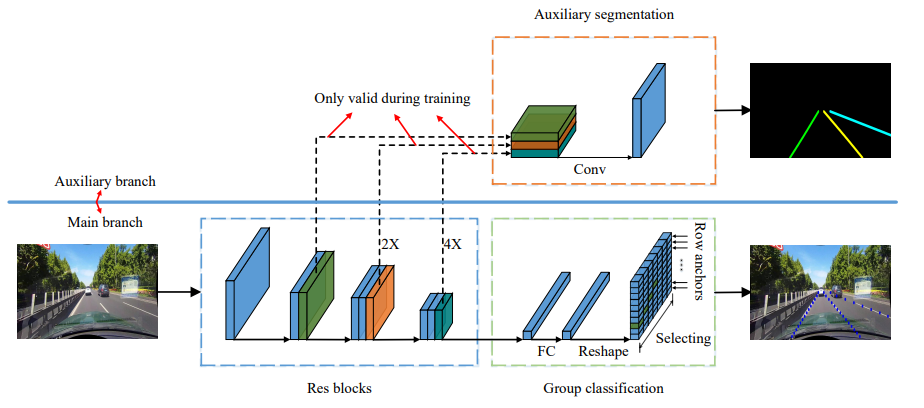
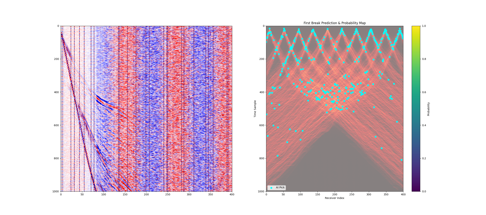
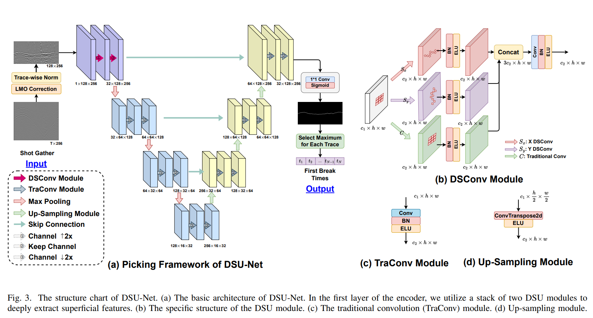
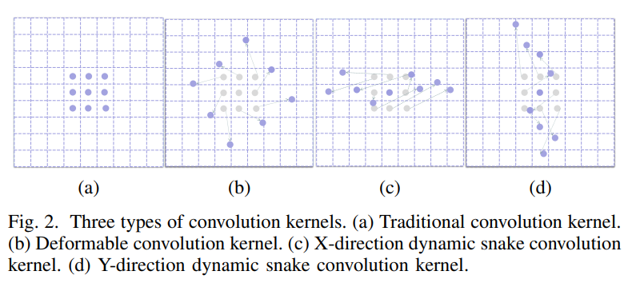
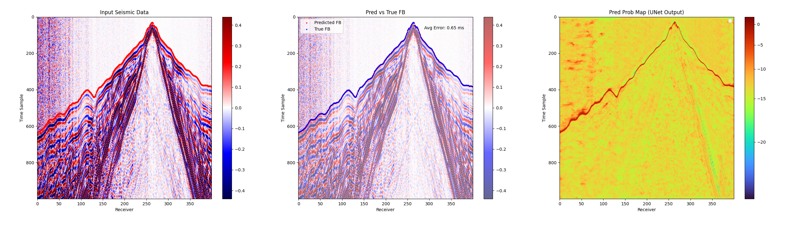
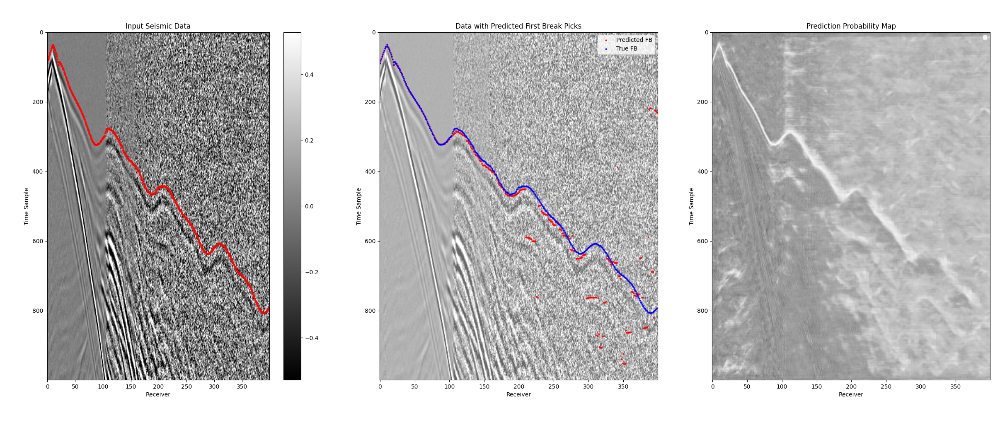
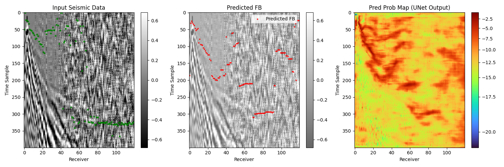

# 总结问题

## 1. UFLD
### 1.1 UFLD原理
论文链接：[Ultra Fast Structure-aware Deep Lane Detection](https://arxiv.org/abs/2004.11757)  
UFLD的模型架构如下：


使用半个U-net作为encoder，提取全图特征，得到latent vector X， 再用一层FC作为分类器，输出一行的预测结果（row anchor）。  

**实现方式：**  
若图片大小是（h行, w列），则label的大小是（h，w+1），最后一列=1时表示这一行没有目标。  
latent vector X 是二维的，需降维（reshape，展开）成一维，连接一个Full Connected Layer，得到一个（1，h*(w+1))的一维向量， 再reshape成二维的（h，w+1)这一步本质上是为每一行训练一个分类器，从w+1的点中分类出目标。  
使用分类（classification）任务而不是回归（regression）任务，的好处是，分类可以得到所有位置的概率分布图，而回归只能得到一个预测结果。

**损失函数**定义为：  
1. 每道classification 结果的交叉熵损失 CrossEntropyLoss，体现概率分布差异
2. 连续性约束。相邻row 预测结果的2范数差之和
3. 二阶导数约束。约束结果为直线。
4. segmentation 二分类损失函数。

有个技巧。从分类器输出的概率分布中，取最大概率的index，作为预测结果。这需要 **max()** 函数，但是max是不可导的，所以作者使用了一种 **近似函数** 。现在这种函数已经有很多了，还比如说： **DTW** 任务里面也有。

### 1.2 我的结构
我使用Colum Anchor每列分类，nt得到+1维度表示没有FB，不使用二阶导损失函数。除此以外都一样。

训练了20轮，**loss变化的很少**。


可以看到，模型输出的概率图里，对0 offset的位置，只会预测在见过的位置上，这说明泛化能力差，然后结果也不连续，这说明训练约束不好。

### 1.3 总结问题： 
1.问题的本质矛盾是**decoder的能力不足**。 

  常规使用完整U-net进行二分类，去分类是before还是after，可以得到不错的准确率，但是有时会出现在after的区域之后又预测了一个before， 违反物理。模型本身并不理解before和after的限制。  

  为了解决这个问题，我想到了UFLD。使用一个简单的FC作为decoder，再用近似max函数在每一列得到预测结果，让模型理解这个规则。  但是，一个FC作为decoder能力太弱，无法理解复杂的FB曲线，泛化能力太弱，只能输出见过的地方。  

  所以我们反思一下，**真正约束到每一列只有一个结果的地方是什么，是在每一列中做近似的max() 找到一个最有可能的FB**。既然如此，为什么要用一个能力这么差的FC做decoder？就用完整的Unet做decoder不行吗？

  所以我看到了接下来的文章**DSU-net**，正是这么做的。  

  另外，使用**topological constraint**似乎也能解决拓扑不符合的问题，没试过。

2.**训练失败分析**  

损失函数的选择失败。我只是用了CE loss和连续性loss，而且比例是1：1，应该在连续性weight more。  

另外，让模型难以优化的原因大概率是连续性loss，因为在0 offset的地方，必然会有一个巨大的损失，这里会成为loss的主导部分，而让其他地方不那么重要，这也解释了为什么在0 offset位置，为什么模型那么喜欢。  

也许应该和原文一样，分别预测左边和右边，这就不同了。

### 1.4 真正失败原因
用AI写代码，在dataset的getitem里做道均衡时，它加了个避免极小值
```python
max_vals = np.max(np.abs(data), axis=1, keepdims=True)  # along NT axis
data[max_vals < 1e-5] = 1e-5 # 罪魁祸首啊！！！！！！！！不能要这一行
data = data / max_vals
```
这样子道均衡后的数据，基本上是空的，因为shot的值太小了!

但是别灰心， 我们前面的分析是对的，完全可以用U-net的decoder去预测整个区域的Possibility Map，在用 max() 函数去限制每道一个。

---  


## 2 DSU-net
### 2.1 DSU-net原理
文章链接[DSU-Net: Dynamic Snake U-Net for 2-D Seismic First Break Picking](https://arxiv.org/pdf/2405.16980)  
模型结构：  
  


可以看到，在DSU-net的最后，是一个1*1conv和sigmoid，得到FB的概率分布图。在对每一道选取最大的possibility做为做种预测的FB。这和之前的UFLD一样，用限定区域的max，限制了一道只有一个FB。  

DSU-net相比U-net更进一步的是，在底层的DS-conv中，增加了横向和纵向的sanke，有了更大的视野和连续性的强调。  

另外，这篇文章还有的一个特点是在FB之前做了NMO矫正，把道集拉平，更加强化了DSU-net的优势。可是NMO需要速度和offset，我不知道作者怎么得到。

### 2.2 测试U-net + sigmoid&max

很棒！目前是:  
 **input** --U-net--> **<font color=Blue>Logistic</font>** --> sigmoid --> **Probability Map**  
 **Loss** = **Binary Cross Entropy Loss(** <font color=Blue>Logistic</font>, label **)**  

 训练了10轮：
 ```bash
 (deepwave) PS E:\dev\deepwave\train_model> python .\a02_train_unet.py
✅ Found 10 files in D:/Dev/FB_dataset/
E:\dev\deepwave\train_model\a02_train_unet.py:58: FutureWarning: `torch.cuda.amp.GradScaler(args...)` is deprecated. Please use `torch.amp.GradScaler('cuda', args...)` instead.
  scaler = GradScaler()

Epoch | Loss     | LR       | Status
--------------------------------------------------
Epoch 1:   0%|                                                                                                                      | 0/1250 [00:00<?, ?batch/sE 
:\dev\deepwave\train_model\a02_train_unet.py:83: FutureWarning: `torch.cuda.amp.autocast(args...)` is deprecated. Please use `torch.amp.autocast('cuda', args...)` instead.
  with autocast():
1     | 0.0593   | 0.001000 | ★ Saved
2     | 0.0046   | 0.001000 | ★ Saved
3     | 0.0034   | 0.001000 | ★ Saved
4     | 0.0031   | 0.001000 | ★ Saved
5     | 0.0030   | 0.001000 | ★ Saved
6     | 0.0029   | 0.001000 | ★ Saved
7     | 0.0028   | 0.001000 | ★ Saved
8     | 0.0027   | 0.001000 | ★ Saved
9     | 0.0027   | 0.001000 | ★ Saved
10    | 0.0027   | 0.001000 | ★ Saved
```
这回是有效训练，Loss一直在下降。  

**训练集上测试：**
```bash
python .\a02_predict.py
```
  
**效果真的很不错了， 但是有些地方连续性差点**
  

**真实数据测试：**
  
他们模型预测的也不好。  

### 2.3 下一步
1. 用近似max确定位置，用连续性约束
2. 加强数据集的噪音强度，增加噪音形态随机性
```
2026.03.04 更新：明天就去合肥进组咯。
```