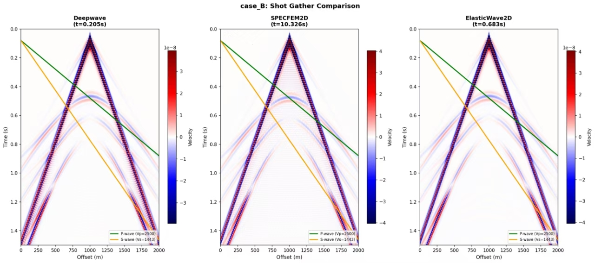
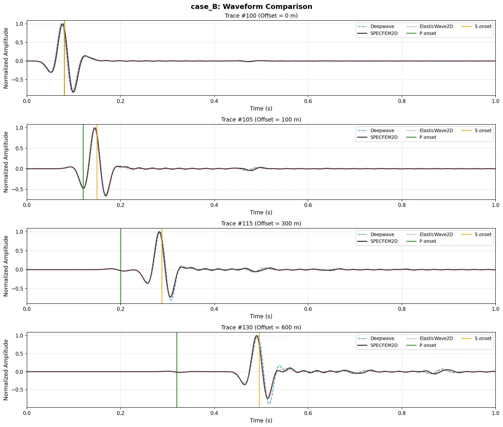

## English

**Deepwave's** forward modeling module is highly efficient and offers excellent accuracy. It supports scalar acoustic, acoustic, and elastic wave equations (using a staggered grid + PML).  
I conducted a benchmark comparing my Julia package, **Fomo.jl**, against both Deepwave and Specfem2D. The results are shown below:  
[Fomo.jl](https://www.github.com/zzzzswh/Fomo.jl)  

**Elastic Wave Module Comparison** Shot Gather Comparison

Waveform/Trace Comparison

Computational Time Comparison
|                     | Deepwave | Fomo.jl | Specfem2D |
|---------------------|----------|---------|-----------|
| Runtime per shot    | 0.205s   | 0.381s  | 10.3s     |

## 中文

**Deepwave**的正演模块效率很高，准确度也不错，支持标量声波方程、声波方程还有弹性波方程（staggered grid + PML）。  
我把我的julia包**Fomo.jl**和他还有specfem2D做过一个**Benchmark**，结果如下：  
[Fomo.jl](https://www.github.com/zzzzswh/Fomo.jl)  

**弹性波模块对比** 炮集对比

波形对比

时间对比
|           |Deepwave | Fomo.jl | Specfem2D |
|-----------|---------|---------|-----------|
|单炮运行时间| 0.205s  | 0.381s  | 10.3s     |