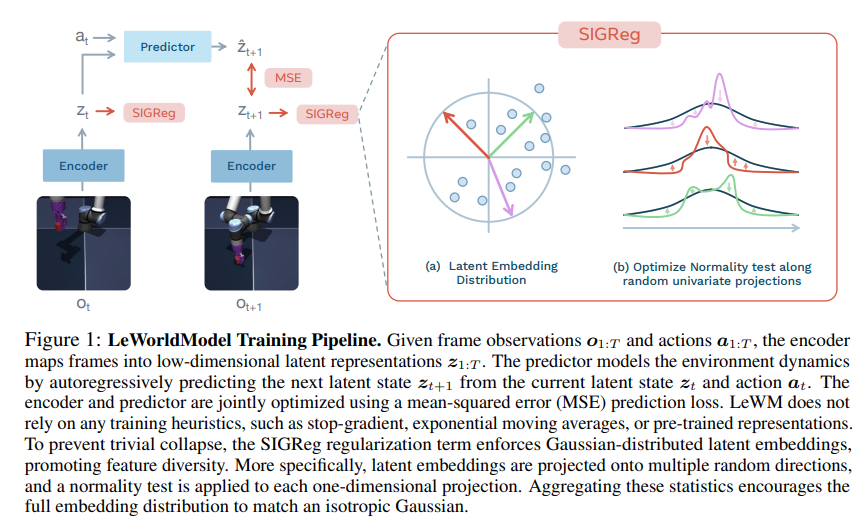
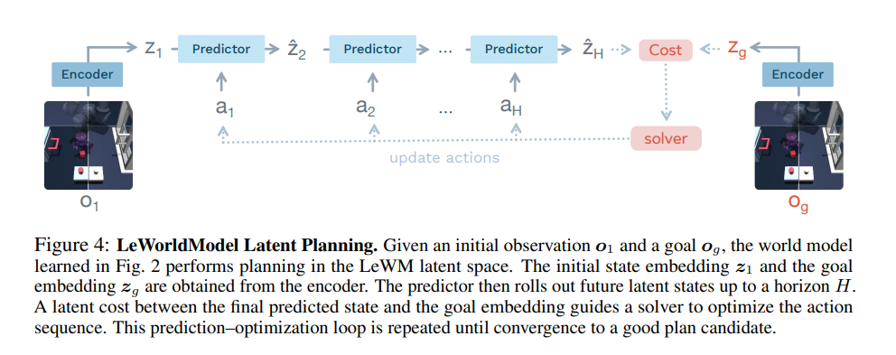
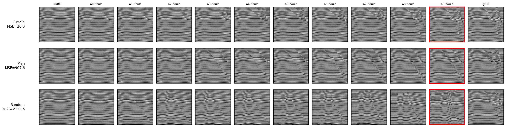

## LeWM：让AI实时自发的学习
这是我觉得LeWM最好玩的地方之一。
想象一下这个过程，一个小孩被关在一个房间里，房间里面有一个小球。这个小球呢符合显示世界的物理规律，动量守恒，能量守恒，牛顿第二力学，等等等等。这个小孩儿呢可以用眼睛观察，可以用大脑思考，可以做动作。

现在这个小孩儿向前提了一脚球然后什么都没做，他看见这个球往前滚了，可能还撞到墙，发现这个球弹回来了，他就有一个思考了。  

LeWM其实也是在重复这个过程。LeWM就像是这个小孩，他只能做这么几件事：“看见”、“思考”、“做动作”。
把整个故事放在一个时间轴上面：
```  
t:      |  0s      |  1s       |  2s               |  3s                                          | ......         
动作：   | 什么都没干 | 踢了一脚   | 什么都没干         | 什么都没干                                     |
看到：   | 球不动    | 球往前滚了  | 球在滚，好像变慢了？ | 撞到墙了，球弹回来了，等会，反射角是不是等于入射角？ | 
```

LeWM就是做一样的事情。但是他的角度是，我我做了一键事情之后，我能不能预测他的结果？  
我踢了一脚球，我能不能预测他的轨迹？  

他把这一切放在了隐空间来做，什么是隐空间？我愿称之为大脑空间或者理解空间。  
对于如今的AI架构来说，一个重要的观点或者做法就是embedding  
也就是让一个叫encoder的网络去理解输入，得到一个隐空间的表示e_t  
这一步是让模型理解    

整个训练的循环是这样的：  
1. 记录现在看到的东西，是一张图片, 而且在t时刻，我们就叫 P_t  
2. 做一个动作，叫a_t  
3. 记录下一时刻看到的东西，在t+1时刻，我们叫P_t+1  
ok, 这个循环就得到了我们要的样本.  
我们首先理解这两张图片的含义：  
P_t -embedding-> e_t  
P_t+1 -embedding-> e_t+1  
a_t -embedding-> ae_t
然后我们训练一个预测器Predictor，输入e_t和ae_t，让他预测e_t+1  

损失定义为两个项：
1. 预测e_t+1和真实e_t+1的距离。MSEloss
2. 隐空间结构不规范的惩罚。SIGReg loss(e_t, e_t+1)

以上我愿称之为 Learning。



## Planning：让模型解决问题
下面这一部分我愿称之为 Planning。
模型刚刚踢了半天球了，我觉得他应该也会踢球了，我想看看他能不能把球踢进框里。
我就给他一个目标goal，这是一张球在篮筐里的图片。

他想：┗|｀O′|┛ 嗷~~，我之前见过这个，我当时怎么怎么样，球在那里了。
这一步是想说，模型一定要见过这个东西才行。  

他看看现在球在什么地方：P_t=0，也就是初始时刻
P_0 -embedding-> e_0
然后最后球要在框里：
P_goal -embedding-> e_goal

然后把球弄进框里就是想一些列的动作action：
```
e_0 -action_1-> e_1
e_1 -action_2-> e_2
...
e_t -action_t+1-> e_t+1
e_t+1 -action_t+2-> e_t+2
...
e_final-1 -action_final-> e_final
```

然后我们最后就是希望 ||e_goal - e_final|| 最小



以上就是LeWM的理念了。

## LeWM for Geophysics ?

### For 处理 ？
LeWM可以帮助我们做什么，在地球物理领域？  
师兄给我说的想法是，我们把庞大的叠前数据放在隐空间做，是不是就更快了？  
--这个好像已经做过好多工作了。

用SIGReg loss做无监督学习？
--这个只是为了规范隐空间的形态而已。

我想的：在实际的地震数据里面我们有很多的步骤和工具，按照一定的顺序来做。
使用的工具和参数就是action，
每一步的数据体就是看到的东西。
但是这个模型出现了一个问题。
1. 不同action之间的区别太大，如何编码。
2. 不同种类数据体之间的差异太大，在隐空间本就应该是分别聚类的，SIGReg项还怎么设计？
3. 整体步骤不多，7~8步，但是action的种类多。这对数据集的要求很高

其实这个也可以做，因为，你只要把action设置好了，他就可以自己一直学习一直跑。

这个让整个流程都一体化，可能前后的参数能做好呼应，一起优化？？？
不可以，因为地震数据处理的每一步基本上不会和后面有什么关系，
比如说你前面去噪没有去干净，后面叠加点速度谱的效果就好差，哪有能怎么样？
逐渐会发现，处理的每一步都是要选取合适的参数把这个任务自己做好，下一步的任务只是依赖上一步做的更好。
换而言之，我们的评价指标存在于每一步，而不是整体。
这也引出另一个问题，地震数据处理、解释、反演，都没有ground truth，我们只能把每一步做到我们觉得很不错了就行。

总结一下问题：
1. 多类型数据体的隐空间分布，是否还因该符合SIGReg
2. action种类丰富如何处理
3. 时间步长较短
4. 没有GT，怎么做planning

## 构造演化？

有很多地质构造引擎，比如说加断层、褶皱、沉积，这些都有代码。  
把这些作为单通道的时序数据，把加断层，褶皱，沉积这些作为action。  
测试模型能不能完成任务，从一个水平层引导到有构造的状态。   
甚至是翻过来，从有构造的反推怎么变成水平层的。

这是一个老任务了，师兄说这个的重点是每一步倒退，都要足够的慢，小，这样才能有解释性。
因为这些东西千变万化，你有无数种可能，这就像是希尔伯特空间一样。

我简单去训练了一下，repo在这里：https://github.com/zzzzswh/geo-lewm

结果在这里：


## 科学问题 or 工程问题

而且师兄说，这些东西都是工程，不是科学。  
科学更多的是是对现象的insights，而不是解决问题。  

我不禁思考，勘探地球物理还有没有解决的科学问题吗？

整个地球物理，也应该只有深部地球结构、大地震预测、余震预测，这些科学问题还在继续讨论吧。

我们这个勘探地球物理，纯粹是为了石油工业降本增效，提供合理的预测。。。  

这么一看，AI还是一个科学和工程非常混合的一个状态，因为这个技术内部就要很多的现象值得研究，因为他们很需要insights去理解。   

给石油公司做工程，不如给AI、互联网公司做工程。

研究石油工业科学，不如研究AI科学。

但是为什么我们老师全是石油公司的的项目啊啊啊
