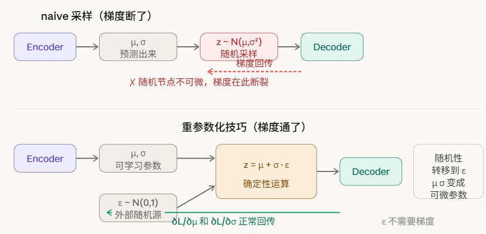
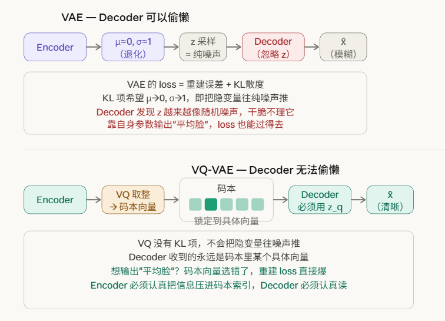
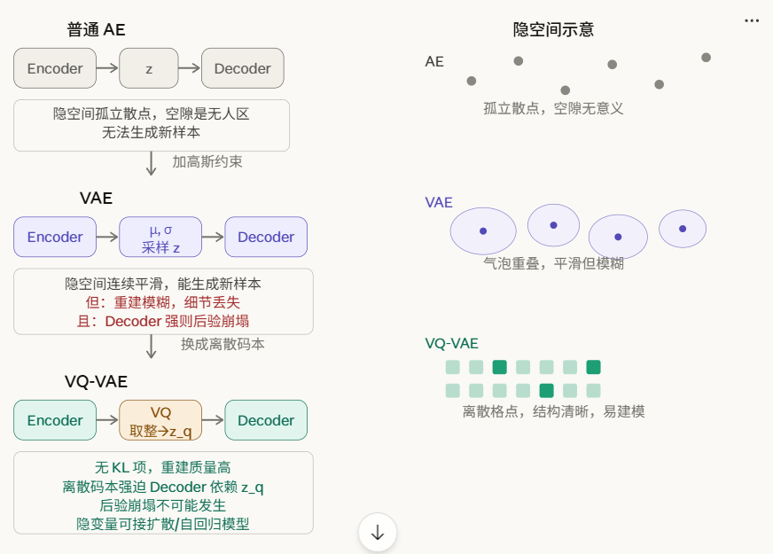

## 1.1什么是VAE

传统 Autoencoder：

```jsx
输入 x  →  Encoder  →  z（一个固定向量）  →  Decoder  →  重建 x̂
```

VAE：

```jsx
输入 x  →  Encoder  →  μ 和 σ（均值和方差）  →  采样 z ~ N(μ, σ²)  →  Decoder  →  重建 x̂
```

这样隐空间是一个高斯分布了，是连续的

## 1.2 好处！

好处是隐空间变得连续且平滑，你可以在隐空间里随便取一个点送给 Decoder，它都能生成有意义的输出。这就是 VAE 能做"生成"的原因——**普通 AE 只会重建，VAE 可以生成新样本。**

**因为如果隐空间不连续，那么相邻的隐向量的含义可能回差异巨大，我们希望相似的输入经过encoder之后能得到相似的隐向量**

**第一，把点变成气泡。** Encoder 不输出一个点，而是输出 `(μ, σ)`，然后在这个高斯气泡里采样。气泡有一定范围，天然**迫使 Decoder 学会处理 μ 附近的一片区域**，而不只是一个精确的点。

**第二，KL 散度正则项。** VAE 的 loss 里除了重建误差，还有一项：

```
KL( N(μ, σ²) ∥ N(0, 1) )
```

这一项**惩罚每个气泡偏离标准正态分布太远**。效果是把所有气泡往原点拉拢，防止不同样本的气泡在隐空间里散得到处都是、互相之间留下大片空隙。

两个手段加在一起，隐空间就变成了你说的那种样子——相似的输入聚在一起，相邻位置的含义平滑过渡，中间没有无人区。这样你在隐空间里随便插值或采样，Decoder 都能给出有意义的输出，**这就是"能生成新样本"的原因。**

## 1.3 如何反向传播 - 重参数化

如果得到了均值和方差，然后随机采样取点，就不能反向传播了，如何解决？



对于每一个batch里，ε是常熟，从而引入了随机性，这叫 ***\*重参数化\**** 技巧

这告诉我们：

**反向传播的最小单位过程是一个batch的学习**

## 1.4硬伤

VAE 本身有两个硬伤

**硬伤一：隐空间太模糊**

VAE 强迫每个样本的隐变量都服从高斯分布，KL 项会把所有气泡往 N(0,1) 拉。这个约束太强了——为了让隐空间平滑，模型被迫牺牲重建质量。生成的图像/信号往往偏模糊，细节丢失。

**硬伤二：后验崩塌（posterior collapse）**

Decoder 如果足够强大，它会学会忽略隐变量 z，完全靠自己的参数重建输入。这样 Encoder 预测的 `(μ, σ)` 变得毫无意义，隐空间失去表达能力。训练表面上收敛了，但隐变量什么都没学到。

**三 容易偷懒**



------

# 2. VQ-VAE

连续空间采样 → 离散各点采样



**AE 不能生成 → VAE 加高斯约束能生成但变模糊 → VQ-VAE 换掉高斯约束、用离散码本解决模糊和崩塌**。

一是**去掉了 KL 项**。不再强迫隐空间服从高斯分布，Encoder 可以自由地把信息压进去，重建质量大幅提升，不再模糊。

二是不会偷懒了


类似于K-means，这个学习构建码本的过程本质是一种聚类算法，让相近的隐向量被聚类为一个码本，

## 2.2 代价

代价是：VQ-VAE 的隐空间是离散的，你不能像 VAE 那样在里面随便插值采样生成新东西。所以 VQ-VAE 通常要在第二阶段再配一个生成模型（你们用的是扩散模型，早期论文用的是自回归模型 PixelCNN）来学习在这些离散码本索引上的分布，从而获得生成能力。

**原因一：把高维冗余空间压缩成低维紧凑表示，让后续的模型（Decoder 或扩散模型）在更小、更结构化的空间里工作，更容易收敛，计算也更高效。**

**原因二：在 Z 上采样获得生成能力。**（VAE 直接在连续 Z 上采样；VQ-VAE 把生成能力外包给第二阶段的扩散模型，在离散 Z 上做去噪。）